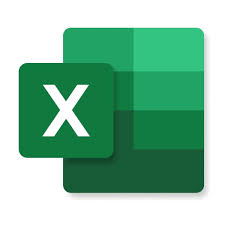

# COFFEE SALES DASHBOARD

# 📊 PROJECT OVERVIEW

This dashboard provides an in-depth look at the performance of three stores in our coffee chain, offering insights that help improve operations. It's an essential tool for discussions with the regional manager and senior leadership, focusing on enhancing efficiency, boosting performance, and driving revenue growth.

# ⚙ TOOLS USED
  

 Microsoft Excel

# 🚀 PROJECT GOALS
- Boost Revenue Growth
- Optimize Operations on Peak Days
- Enhance Service Efficiency in the Morning
- Focus on Popular Products
- Maintain Leadership in Key Categories
- Ensure Consistency Across All Locations

# 📈 INSIGHTS
Key Insights from Project

- Revenue Growth: All stores show steady revenue growth, indicating positive trends.
- Busiest Days: Mondays, Thursdays, and Fridays see the most traffic, likely due to people stopping by for coffee on their way to work.
- Peak Hours: The morning rush is the busiest time, as customers grab their coffee during their commute.
- Category and Product Performance: Coffee leads the sales, with the Barista Espresso being the most popular item across all stores.
- Consistency: Customer behavior and preferences are consistent across all locations.

# 🧠 DATA STORY

Additional Insights and Recommendations

- Underperforming Products: Some products, like certain coffee bean varieties and flavored items, aren’t performing well across all locations.
- Merchandise Sales: Clothing sales at the Hell's Kitchen store are much lower than at other stores.
  
Recommendations
- Hell’s Kitchen Store: Offer discounts on merchandise to boost sales and remove low-performing items from display; they could be available for special order only.
- Inventory Optimization: Review inventory of underperforming products and consider reducing stock to save costs.

# 📊 DASHBOARD

